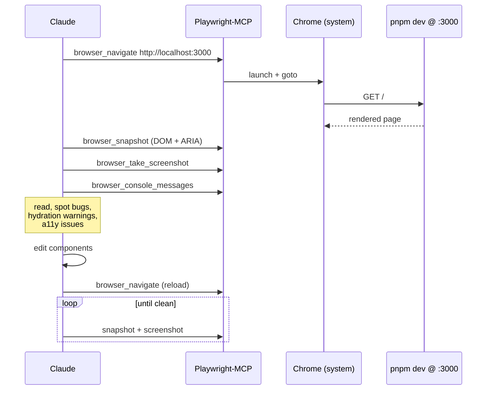

# Claude Code — Setup on a fresh clone

> This repo was built with Claude Code. `.claude/` is **gitignored**, so
> after cloning on a new machine, Claude Code will work but will not
> have the same plugins, permissions, or project skill enabled until you
> re-run the steps below. `CLAUDE.md` and `OVERVIEW.md` are committed
> and will be picked up automatically.

---

## 1. Prerequisites

On the new laptop, install these before opening the repo in Claude Code:

| Tool | Why | Check |
|---|---|---|
| [Claude Code](https://claude.com/claude-code) CLI or IDE extension | The harness that runs everything below | `claude --version` |
| [Foundry](https://book.getfoundry.sh/) (`foundryup`) | Contract build + tests | `forge --version` |
| Node ≥ 20 + [pnpm](https://pnpm.io/) | Frontend dev server | `node -v && pnpm -v` |
| [Google Chrome stable](https://www.google.com/chrome/) | Playwright-MCP opens a real Chrome — it does **not** ship its own browser | `which google-chrome-stable` |
| `anvil` (bundled with Foundry) | Local fork used for review | `anvil --version` |

> On first Playwright-MCP use we hit a hard blocker: the MCP server
> couldn't launch a browser until `google-chrome-stable` was installed
> from Google's .deb (see [frontend/DECISIONS.md](frontend/DECISIONS.md)).
> Do this step before the review loop.

---

## 2. Plugins used by this project

The project's `.claude/settings.json` (not committed) enables these five
plugins from the **`claude-plugins-official`** marketplace. Install them
on the new machine with `/plugin` inside Claude Code, or by writing
`settings.json` yourself (see §4).

| Plugin | What we use it for | Key skills / tools it provides |
|---|---|---|
| `claude-code-setup@claude-plugins-official` | Re-onboarding + automation recommendations when bootstrapping | `claude-automation-recommender` |
| `frontend-design@claude-plugins-official` | Anything under `frontend/` — component design, polish pass, craft-level review | `frontend-design`, `frontend-design-guidelines` |
| `code-review@claude-plugins-official` | PR review sweeps after each frontend slice and before contract changes land | `code-review:code-review` |
| `playwright@claude-plugins-official` | Headless Chrome driver for the frontend review loop (see §5) | `mcp__plugin_playwright_playwright__browser_*` tool family |
| `claude-md-management@claude-plugins-official` | Audit + revise `CLAUDE.md` as the repo evolves | `claude-md-improver`, `revise-claude-md` |

Commands (run inside a Claude Code session at the repo root):

```
/plugin install claude-code-setup@claude-plugins-official
/plugin install frontend-design@claude-plugins-official
/plugin install code-review@claude-plugins-official
/plugin install playwright@claude-plugins-official
/plugin install claude-md-management@claude-plugins-official
```

If `claude-plugins-official` isn't in your marketplace list, add it
first via `/plugin marketplace add` — follow the prompts.

---

## 3. Superpowers skills we lean on

These ship with the `superpowers` skill bundle and are triggered by
conversation cues rather than installed per-project. Don't configure
them here; just be aware they're what drives how Claude operates on
this repo:

- `superpowers:using-superpowers` — the boot skill; loaded at session start
- `superpowers:brainstorming` — used before any creative / design work
- `superpowers:test-driven-development` — used before writing any new contract or test code
- `superpowers:systematic-debugging` — used on any unexpected revert or test failure
- `superpowers:verification-before-completion` — run `forge test` / `pnpm build` before claiming work is done
- `superpowers:writing-plans`, `superpowers:executing-plans` — multi-step work
- `superpowers:dispatching-parallel-agents` — when review + implementation can fan out

You don't need to install these manually if your Claude Code
environment already has superpowers enabled (check your user-level
`~/.claude/` for a skills dir).

---

## 4. Project-local Claude config (what `.claude/` contained)

Because `.claude/` is in `.gitignore`, nothing in it is cloned. If you
want the same experience on the new machine, recreate these two files
by hand — they're short.

### 4.1 `.claude/settings.json` — enabled plugins (project-level)

```json
{
  "enabledPlugins": {
    "claude-code-setup@claude-plugins-official": true,
    "frontend-design@claude-plugins-official": true,
    "code-review@claude-plugins-official": true,
    "playwright@claude-plugins-official": true,
    "claude-md-management@claude-plugins-official": true
  }
}
```

### 4.2 `.claude/settings.local.json` — permission allowlist (per-machine)

This is the minimum set of tool calls we pre-approve so the session
stops asking for permission on every Forge run and Playwright step:

```json
{
  "permissions": {
    "allow": [
      "Bash(forge --version)",
      "Bash(forge build:*)",
      "Bash(forge test:*)",
      "Bash(forge coverage:*)",
      "mcp__plugin_playwright_playwright__browser_console_messages",
      "mcp__plugin_playwright_playwright__browser_navigate",
      "mcp__plugin_playwright_playwright__browser_take_screenshot",
      "mcp__plugin_playwright_playwright__browser_resize",
      "mcp__plugin_playwright_playwright__browser_snapshot",
      "mcp__plugin_playwright_playwright__browser_click",
      "mcp__plugin_playwright_playwright__browser_press_key",
      "mcp__plugin_playwright_playwright__browser_wait_for",
      "mcp__plugin_playwright_playwright__browser_evaluate"
    ]
  }
}
```

Expand the allowlist at your own risk — every new entry removes a
confirmation prompt for a family of tool calls.

### 4.3 `.claude/skills/grill-me/SKILL.md` — project-local skill

A one-file skill kept at the project level. Re-create it if you want
the `/grill-me` trigger to work here:

```markdown
---
name: grill-me
description: Interview the user relentlessly about a plan or design until reaching shared understanding, resolving each branch of the decision tree. Use when user wants to stress-test a plan, get grilled on their design, or mentions "grill me".
---

Interview me relentlessly about every aspect of this plan until we reach a shared understanding. Walk down each branch of the design tree, resolving dependencies between decisions one-by-one. For each question, provide your recommended answer.

Ask the questions one at a time.

If a question can be answered by exploring the codebase, explore the codebase instead.
```

### 4.4 Optional: commit the shareable parts

If you want a future clone to "just work" without rebuilding `.claude/`,
you can remove `.claude/` from `.gitignore` and commit only:

- `.claude/settings.json` (safe — just plugin list)
- `.claude/skills/grill-me/` (safe — just a prompt template)

And keep `.claude/settings.local.json` ignored (it's per-user). The
`.gitignore` would become:

```gitignore
.claude/*
!.claude/settings.json
!.claude/skills/
.claude/settings.local.json
```

Decide based on whether you want team members to share the same plugin
set by default.

---

## 5. Playwright-MCP usage — the frontend review loop

The frontend in this repo was built slice-by-slice, with Claude
reviewing every UI change through Playwright-MCP before marking it
done. To reproduce that loop on the new laptop:

### 5.1 One-time: install Google Chrome stable

```bash
# Ubuntu/Debian
wget https://dl.google.com/linux/direct/google-chrome-stable_current_amd64.deb
sudo apt install ./google-chrome-stable_current_amd64.deb
which google-chrome-stable    # should print a path
```

The Playwright-MCP plugin drives this system browser; without it every
`browser_navigate` fails.

### 5.2 Start the backing environment

```bash
# Terminal 1 — local mainnet fork
anvil --fork-url $BASE_RPC_URL --chain-id 8453 --host 127.0.0.1 --port 8545

# Terminal 2 — deploy vaults + strategies into the fork
source .env
forge script script/DeployDual.s.sol:DeployDual \
  --rpc-url http://127.0.0.1:8545 --broadcast
forge script script/SeedStrategies.s.sol:SeedStrategies \
  --rpc-url http://127.0.0.1:8545 --broadcast

# Terminal 3 — frontend dev server
cd frontend
cp .env.example .env.local      # fill NEXT_PUBLIC_WALLETCONNECT_PROJECT_ID
pnpm install
pnpm dev                        # serves at http://localhost:3000
```

Point `NEXT_PUBLIC_BASE_RPC_URL` at `http://127.0.0.1:8545` so wagmi's
`base` chain id (8453) resolves to your local anvil instead of calling
real mainnet. Frontend requests go through `/api/rpc/[chain]`, so CORS
is handled.

### 5.3 The review pattern Claude uses

When you ask Claude to build or change a frontend slice, it will run
this loop until the UI is clean:



The tool calls you'll see most:

| Tool | Used for |
|---|---|
| `browser_navigate` | open / reload a page |
| `browser_snapshot` | DOM+ARIA dump — how Claude "reads" the UI |
| `browser_take_screenshot` | visual diff |
| `browser_console_messages` | hydration errors, React warnings, RPC failures |
| `browser_click`, `browser_type`, `browser_press_key` | interact with forms |
| `browser_wait_for` | wait on text / selector after a nav or click |
| `browser_resize` | flip between desktop + mobile widths (a real regression spot — see [frontend/DECISIONS.md](frontend/DECISIONS.md) §Slice 1 mobile header fix) |
| `browser_evaluate` | run one-off JS in the page (read localStorage, poke a store) |

Cache and logs land in `.playwright-mcp/` (also gitignored). Safe to
delete between sessions.

### 5.4 Known gotcha — wallet connection

Playwright-MCP can drive the UI but **cannot complete RainbowKit's
wallet handshake headlessly**. The E2E "connect → sign → deposit"
flow was deferred for this reason. The documented workaround is a
mocked wagmi connector that uses viem's `privateKeyToAccount` with
anvil's default funded account. Not implemented yet — see the
"Still deferred" section in [frontend/DECISIONS.md](frontend/DECISIONS.md).

---

## 6. Quick checklist for a new laptop

- [ ] Install Claude Code
- [ ] Install Foundry (`foundryup`)
- [ ] Install Node + pnpm
- [ ] Install `google-chrome-stable` system-wide
- [ ] Clone the repo
- [ ] `forge install` (pulls `lib/forge-std` + `lib/openzeppelin-contracts`)
- [ ] `cd frontend && pnpm install`
- [ ] `cp .env.example .env` (root) and `frontend/.env.example frontend/.env.local`, fill RPCs + WalletConnect project id
- [ ] Open the repo in Claude Code
- [ ] Run the five `/plugin install` commands from §2
- [ ] Recreate `.claude/settings.local.json` (§4.2) so permissions don't prompt on every Forge/Playwright call
- [ ] Optional: recreate `.claude/skills/grill-me/SKILL.md` (§4.3)
- [ ] Ask Claude anything — if it says "I'll use the X skill" and X is in §2 or §3, you're wired up correctly

---

## 7. Things that would surprise you

- **`superpowers:using-superpowers` runs at the start of every session**
  and is what triggers the other superpowers skills. If it doesn't fire,
  your superpowers bundle isn't enabled — check `~/.claude/` (user-level).
- **Playwright-MCP does not use the Playwright that's in
  `frontend/package.json`.** That dep is for `@playwright/test` if we
  ever wire up headless E2E; the MCP server ships its own binary.
- **`.claude/` is fully gitignored**, not just the local-state subpaths.
  Take a look at §4.4 if you want to change that.
- **`cast call isReady()(bool)`** in [script/drip.sh](script/drip.sh)
  needs `foundryup` to have installed `cast`. If the keeper loop errors,
  check `which cast`.
