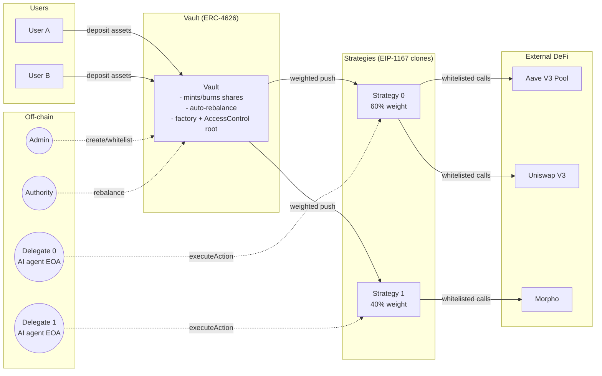
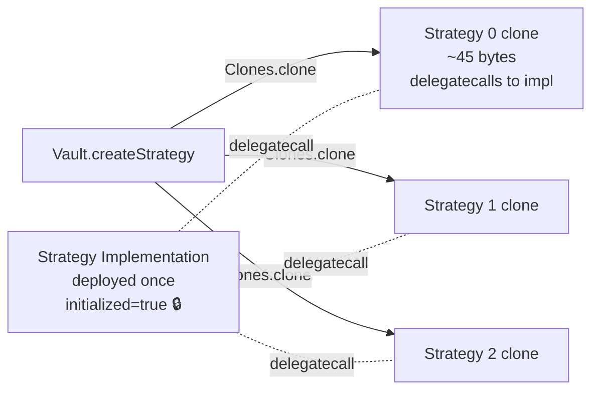
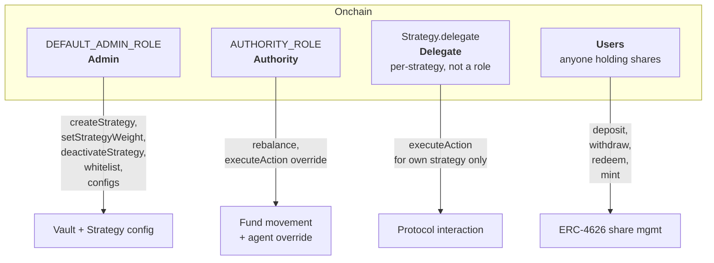
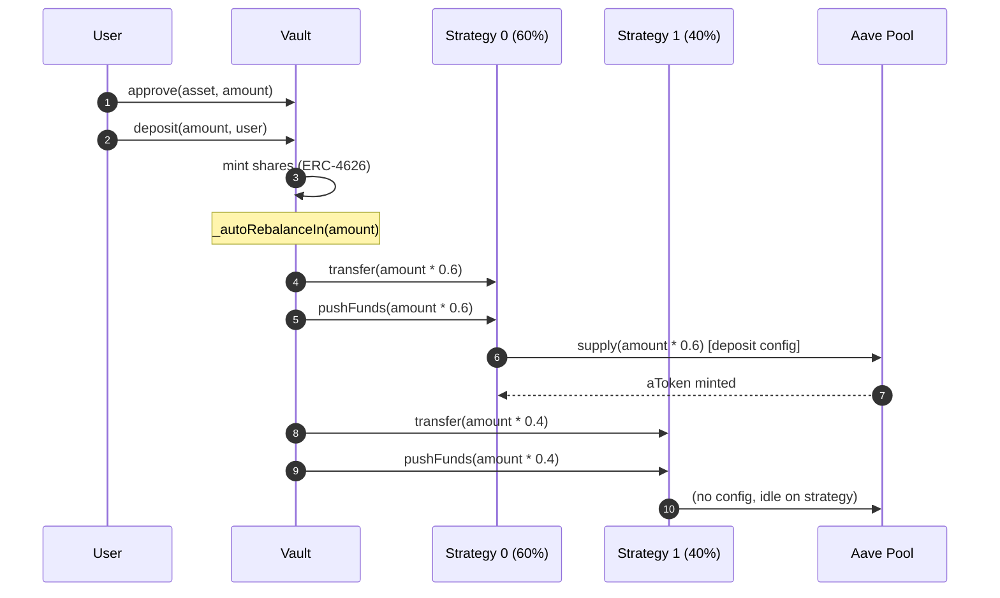
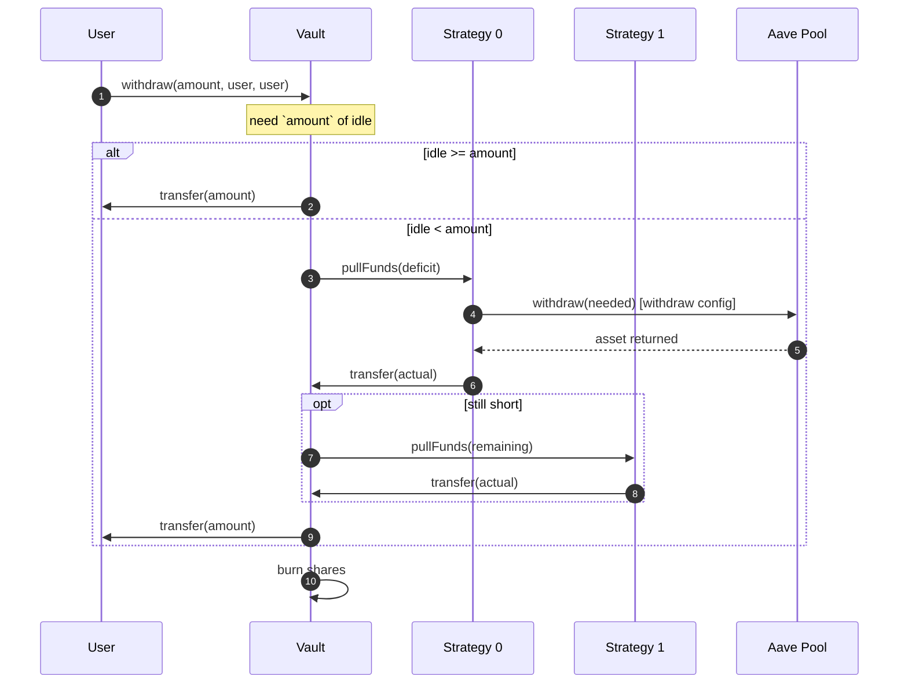
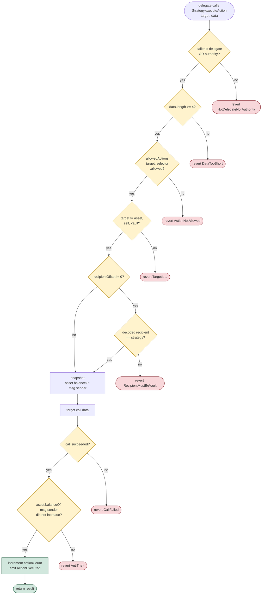
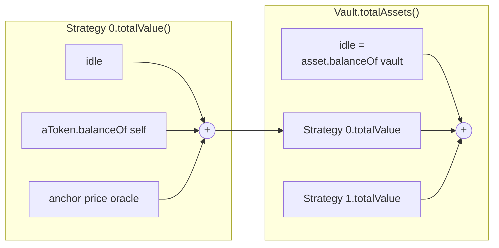
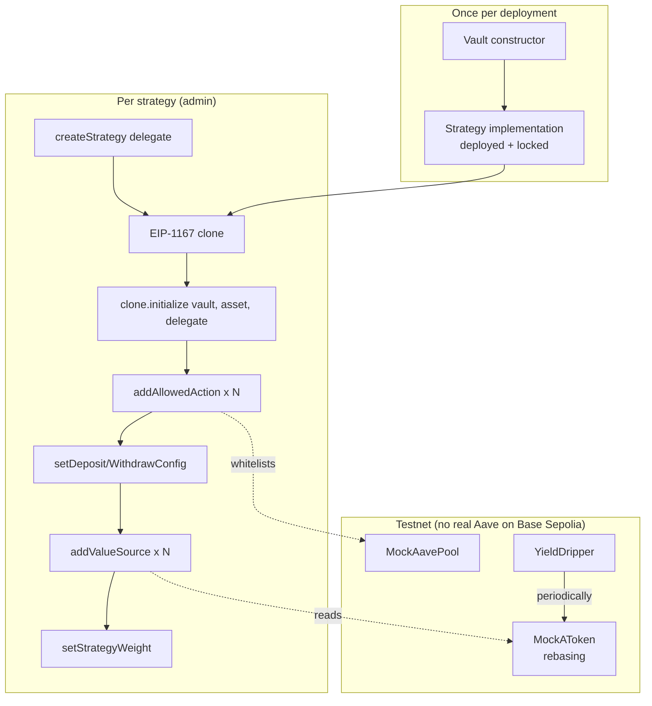

# AISandbox — High-Level Overview

> **One line:** a non-custodial ERC-4626 vault where AI agents manage real
> capital inside a sandbox small enough that a compromised agent can't steal,
> drain, or misroute user funds.

---

## 1. The problem

You want an **autonomous AI agent** to actively manage DeFi positions —
lend into Aave, borrow, swap, loop, rebalance — **on behalf of many users**.

Three things that make this hard:

| Concern              | What can go wrong                                                           |
| -------------------- | --------------------------------------------------------------------------- |
| **Custody**          | Agent keys get phished → the agent drains the vault.                        |
| **Silent misuse**    | Agent makes an innocent-looking tx that quietly sends funds to an attacker. |
| **Spread of damage** | One bad strategy shouldn't hurt users who chose a different strategy.       |

AISandbox answers all three: **the agent never holds user funds, can
only call pre-approved protocol actions, and each strategy lives in its
own separate contract.**

---

## 2. The design in one picture



**In short:**

- Users only interact with the **Vault** (deposit/withdraw shares).
- The vault **splits each deposit across strategies** by target weight.
- Each **Strategy is a separate contract** that holds its own slice and
  any external positions (aTokens, LP positions, etc.).
- AI agents act **through** their strategy via `executeAction` — they
  never touch tokens directly.

---

## 3. Three core ideas

### 3.1 Strategies are real contracts, not just ledger rows

Most multi-strategy vaults just remember how much each strategy owns in
a lookup table. AISandbox instead deploys a **separate Strategy
contract per strategy**, cloned via EIP-1167 minimal proxies.



**Why this matters:** a compromised strategy can only lose **its own**
funds. Strategy 0's delegate can't touch Strategy 1's aTokens, because
they live at a different address with different approvals.

### 3.2 The whitelist is scoped to each strategy

The delegate never gets token approvals. They call
`Strategy.executeAction(target, data)`, which checks a per-strategy list:

```
allowedActions[target][selector] → { allowed, recipientOffset }
```

Whitelisting `aavePool.supply` on Strategy 0 does **not** let Strategy
1's delegate supply, even though the selector is the same.

### 3.3 Anti-theft check on every call

Even with a whitelisted call, the delegate could try calling something
like `someRouter.swapToSelf(...)` if the admin slipped up. AISandbox
catches this with a simple rule enforced at call time:

> **The caller's asset balance must not go up after the call.**

If it does, the call reverts. Paired with the `recipientOffset` check
(the recipient encoded in calldata must equal the strategy itself, not
the delegate), damage stays small even if the whitelist has a gap.

---

## 4. Roles



| Role          | Held by                     | Can do                                                         | Cannot do                                              |
| ------------- | --------------------------- | -------------------------------------------------------------- | ------------------------------------------------------ |
| **Admin**     | Multisig / DAO              | Configure vault + strategies, whitelist actions                | Move funds directly                                    |
| **Authority** | Rebalancer EOA / keeper     | Push/pull funds between vault ↔ strategies; override any agent | Change whitelists                                      |
| **Delegate**  | AI agent EOA (per strategy) | Invoke whitelisted actions on its own strategy                 | Touch any other strategy, move funds outside whitelist |
| **User**      | Anyone                      | ERC-4626 deposit/withdraw                                      | Anything privileged                                    |

---

## 5. User flow — deposit



The deposit is **split by each strategy's weight as-is** (not scaled to
100%): if active weights add up to less than 10_000 bps, the remainder
stays idle in the vault as a liquidity buffer.

## 6. User flow — withdraw



Strategies are tried **in the order they were created**. If the last
strategy still can't free up enough, the whole withdraw reverts with
`InsufficientLiquidity`.

---

## 7. Agent flow — executeAction validation steps

This is the most important flow. Every AI action goes through it.



Every failure branch is a tested revert in
[test/unit/StrategyActionWhitelist.t.sol](test/unit/StrategyActionWhitelist.t.sol).

---

## 8. NAV — how the vault knows what it's worth



- `Strategy.totalValue() = idleBalance + Σ valueSources`
- Each **value source** is a `(target, data)` read-only call set up by
  the admin (e.g. `aUSDC.balanceOf(strategy)`).
- The vault's `totalAssets()` is a **live scan over every strategy** —
  no stored snapshot. Share price reflects protocol state at the exact
  block it's read.

This is why yield from rebasing aTokens (or our mock
[YieldDripper](src/mocks/YieldDripper.sol)) shows up **automatically** in
the share price — no `reportYield` call needed.

---

## 9. Deployment topology



On **Base Sepolia** (see [DEPLOYMENTS.md](DEPLOYMENTS.md)):

- Two vaults: `avUSDC`, `avWETH`
- Each USDC strategy points at `MockAavePool` + `aUSDCm` rebasing aToken
- `YieldDripper` drips yield into `aUSDCm` on a schedule — simulates
  interest accrual so demo vaults show realistic share-price growth

On **Base mainnet**: same scripts, swap in the real Aave V3 Pool
address. No production deployment yet.

---

## 10. Security model

| Threat                                                 | Mitigation                                                                                       |
| ------------------------------------------------------ | ------------------------------------------------------------------------------------------------ |
| Agent key is stolen and tries to drain the vault       | Agent has no token approvals; must go through the per-strategy whitelisted selector.             |
| A whitelisted call tries to reroute funds              | Anti-theft check on caller balance + optional `recipientOffset` check.                           |
| Strategy A's delegate tries to move Strategy B's funds | Strategies are separate contracts with separate approvals.                                       |
| Re-entrancy during action execution                    | `nonReentrant` on every external fund-movement entrypoint on both Vault and Strategy.            |
| Inflation attack on a fresh vault                      | `_decimalsOffset = 6` (OpenZeppelin virtual shares pattern).                                     |
| Admin makes a mistake                                  | Strategy deactivation is **permanent** — there's no way to turn one back on.                     |
| Strategy gets re-initialized                           | Implementation constructor locks `initialized = true`; `initialize` can only run once per clone. |

---

## 11. What's not in scope

The following are **deliberately deferred** — see [TODO.md](TODO.md):

- VaultFactory (multi-vault registry with cheaper clones)
- Emergency pause / circuit breaker (`PAUSER_ROLE`)
- Per-action gas or loss caps
- Protocol / performance fees
- Token allowlist for swap outputs (currently an agent with a whitelisted
  router can park funds in any output token the router supports)
- Reactivation path (intentionally never)

These can all be added on later; the core model is stable.

---

## 12. How to pitch it

If you get 60 seconds:

> AISandbox is an ERC-4626 vault that lets AI agents move real money
> without being able to steal any of it. Each strategy is a separate
> sandbox contract. The agent can only call pre-approved DeFi actions,
> and even then, if any of those actions would reroute assets to the
> agent's own wallet, the transaction reverts on-chain. Users deposit
> once, the vault fans their money across strategies by weight, and
> NAV is computed live from the positions each strategy holds.

If you get 5 minutes: §2, §3, §7 (the validation flowchart), §10.

If they have engineers in the room: also §8 (NAV) and §6 (withdraw
fallback chain).

---

## 13. Further reading

- [EVM_VAULT_SPEC.md](EVM_VAULT_SPEC.md) — original build spec (some sections describe goals that aren't built yet; see TODO.md).
- [CLAUDE.md](CLAUDE.md) — build/test commands + architecture notes for contributors.
- [DEPLOYMENTS.md](DEPLOYMENTS.md) — live addresses on Base Sepolia + local anvil.
- [TODO.md](TODO.md) — deferred items and open design questions.
- [frontend/DECISIONS.md](frontend/DECISIONS.md) — UI architecture decisions.
